La semana pasada se celebraron a la vez dos congresos a los que no me hubiera importado para nada asistir. Por un lado, se celebró en Sevilla, del 31 de enero al 4 de febrero, el [Congreso de la Asociación Española de Ecología Terrestre (AEET)](http://www.medecos-aeet-meeting2017.es/), que este año iba en conjunto con MEDECOS, el congreso que organiza la International Society of Mediterranean Ecology. Por otro lado, la Fundación Pau Costa organizaba en Barcelona ICOPFIRES, el [Congreso Internacional sobre Quemas Prescritas](http://www.paucostafoundation.org/ICoPFires/), que este año se hizo coincidir además con la [Wildland Fire Safety Summit](http://www.paucostafoundation.org/ICoPFires/wildland-fire-safety-summit/).

Como os decía, hubiera encontrado cualquiera de los dos muy interesante, porque además en cualquiera de ellos tenía numerosos colegas - aunque más en Sevilla, donde además el lab estuvo representado por este póster. Por suerte, los que nos tenemos que quedar en casa tenemos hoy en día herramientas para ir siguiendo los momentos más interesantes de los congresos, y una de las más ágiles en este sentido es sin duda twitter. Los dos congresos tuvieron la buena iniciativa de definir con antelación un hashtag claro, [#AEETMED](https://twitter.com/search?q=%23AEETMED&src=tyah) para el de Sevilla, [#iCOPFires](https://twitter.com/search?q=%23icopfires&src=typd) para el de Barcelona, y así muchos pudimos seguir desde nuestro ordenador o móvil los momentos más destacados.

Pero ¿cuál de los dos eventos tuvo más repercusión?¿Cuándo y quién tuiteó desde los congresos? ¿Quiénes fueron los tuiteros más activos? Es lo que me pretendo analizar hoy, aprovechando que se puede extraer fácilmente la información a partir de la API de Twitter. Antes de meternos en harina, quiero dejar claro que el código que he utilizado para descargar los tuits y analizar las tendencias no es originalmente mio, sino una adaptación de diversas fuentes, en concreto [esta](https://github.com/fmichonneau/evol2015-tweets), [esta](https://github.com/jlehtoma/iccb2015-tweets/blob/gh-pages/index.Rmd), [esta](http://rollinsonecology.com) y [esta](https://github.com/khturner/HashtagISME16) Los tweets que incluian el hashtag #AEETMED se recopilaron de ka APU de RTwitter mediante el paquete [twitteR](https://cran.r-project.org/web/packages/twitteR/index.html) y la entrada la he escrito utilizando RMarkdown, y el codigo fuente y los datos est?nAdemás, todo el código y los datos están [disponibles en mi GitHub](https://github.com/ameztegui/Hashtag_Analysis). Dicho esto, al lío.

Según los organizadores, el iCOPFires acogió en total a unos 500 asistentes, mientras que AEETMED reunió a unos 600.  En cuanto a número de tuits generados la cosa anduvo bastante pareja, como se ve en esta tabla.


|Descripcion | AEETMED | iCOPFires
|------------|---|---|
|Numero total de tweets generados | 1282|1229|
|Numero total de tweets originales (sin contar retweets): | 486| 263|
|Numeros de usuarios que han tuiteado: | 254|288|


#### Actividad durante la semana

Como la API permite importar la fecha y hora del tuit, podemos ver en qué momentos se produjo más actividad.

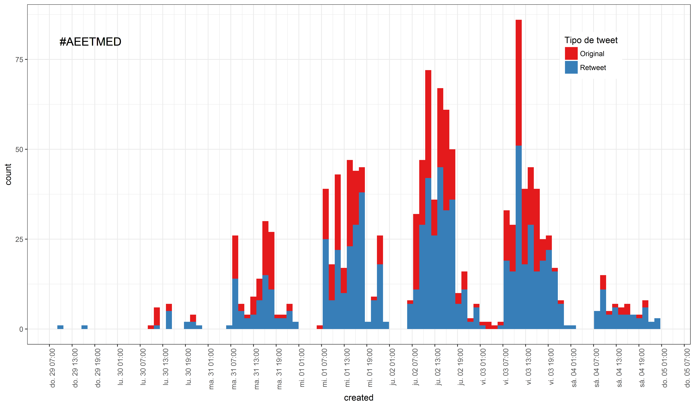

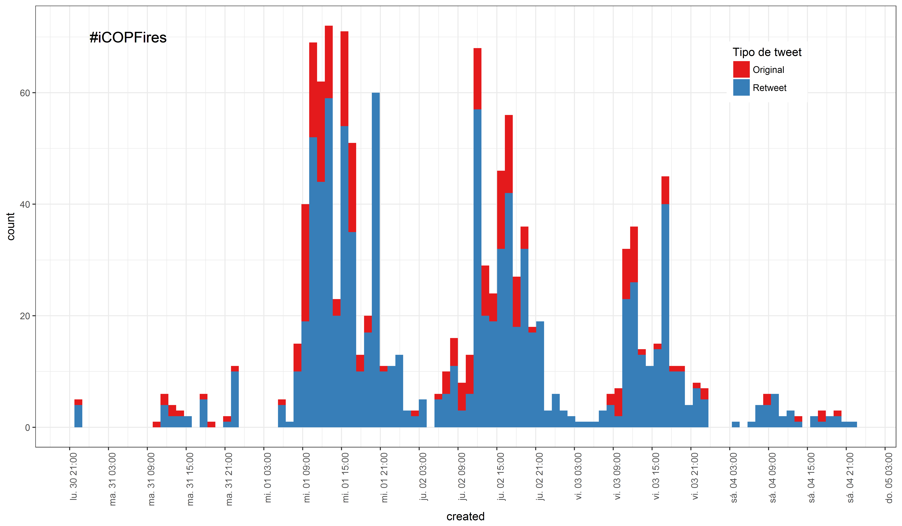

Vemos que en el congreso de la AEET el grueso de actividad se produjo el jueves y el viernes, mientras que en el de quemas prescritas se tuiteó sobre todo miércoles y jueves. Además, en los dos casos parece que la proporción de retuits fue más alta por la tarde, veamos si es así:


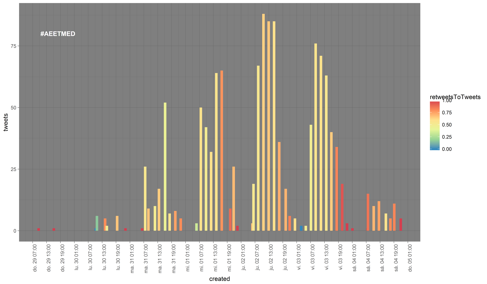


```
## Warning: position_stack requires non-overlapping x intervals
```

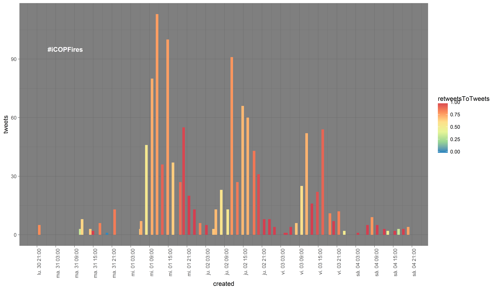
Efectivamente, el ratio retweets/tweets originales es más alto por la tarde en ambos congresos, y es que no éramos pocos los que consultábamos los **highlights** de la jornada al llegar a casa por la tarde, retuiteando lo que nos parecia mas interesante. Pero también destaca que el ratio de retuits por tuit fue mucho más alto para el congreso de quemas prescritas, lo que muestra que los tuits generados alrededor de este congreso se difundieron más. 

Como no quiero que esta entrada se convierta en una competición de un congreso contra el otro, ni que se haga demasiado larga, a partir de aquí analizaremos los datos por separado para cada uno de ellos. Hoy empezaremos por el que se celebró más lejos de mi, en Sevilla (el AEETMED), y publicaré el análisis de #ICOPFires lo antes posible, en una entrada separada.

Como decíamos, se generaron durante la semana pasada 1282 tuits con la etiqueta #AEETMED, con 254 usarios distintos tuiteando en algún momento de la semana. Estos fueron los 5 tuits más retuiteados:

<blockquote class="twitter-tweet" lang="en"> 
<p lang="en" dir="ltr">Heres: Widespread tree declines across #Spain linkes to #climatechange #AEETMED #forests https://t.co/SBToLZrxCO</p>&mdash; <a href="https://twitter.com/JCSvenning">JCSvenning</a>&nbsp;|&nbsp;<a href="https://twitter.com/JCSvenning/status/827075338693914624"> 2017-02-02</a> &nbsp;|&nbsp;16 retweets, 12 favorites. </blockquote>
 
<blockquote class="twitter-tweet" lang="en"> 
<p lang="en" dir="ltr">Genial encontrar gente con ideas interesantes e ilusionantes en la Asamblea del grupo de Ecoinformática… https://t.co/q0Goys6fy0</p>&mdash; <a href="https://twitter.com/ajpelu">ajpelu</a>&nbsp;|&nbsp;<a href="https://twitter.com/ajpelu/status/827153749382721536"> 2017-02-02</a> &nbsp;|&nbsp;14 retweets, 5 favorites. </blockquote>
 
<blockquote class="twitter-tweet" lang="en"> 
<p lang="en" dir="ltr">En unas horas arranca el XIV #Congreso Internacional de Ecosistemas Mediterráneos #MEDECOS #AEETMED… https://t.co/GmfsNQImpj</p>&mdash; <a href="https://twitter.com/InvestigaUS">InvestigaUS</a>&nbsp;|&nbsp;<a href="https://twitter.com/InvestigaUS/status/826338744500420608"> 2017-01-31</a> &nbsp;|&nbsp;12 retweets, 17 favorites. </blockquote>
 
<blockquote class="twitter-tweet" lang="en"> 
<p lang="en" dir="ltr">Reflexiones de Fco Lloret Montse Vilá y Adrián Escudero sobre la ecología en España #AEETMED: fuga de talento y car… https://t.co/CrCEzo8ood</p>&mdash; <a href="https://twitter.com/pedro_jordano">pedro_jordano</a>&nbsp;|&nbsp;<a href="https://twitter.com/pedro_jordano/status/826832679509299200"> 2017-02-01</a> &nbsp;|&nbsp;11 retweets, 10 favorites. </blockquote>
 
<blockquote class="twitter-tweet" lang="en"> 
<p lang="en" dir="ltr">#AEETMED starts today. Special thanks to the awesome @MFontiguell for the beautiful logo she designed for us! https://t.co/IHUWB93KNa</p>&mdash; <a href="https://twitter.com/_AEET_">_AEET_</a>&nbsp;|&nbsp;<a href="https://twitter.com/_AEET_/status/826332927374061568"> 2017-01-31</a> &nbsp;|&nbsp;11 retweets, 9 favorites. </blockquote>
 

Y estos los más marcados como favoritos:

<blockquote class="twitter-tweet" lang="en"> 
<p lang="en" dir="ltr">What a great #AEETMED A pleasure presenting our work funded by @ERC_Research &amp; pleased to see so much interest on… https://t.co/Cn0M1PrO68</p>&mdash; <a href="https://twitter.com/ftmaestre">ftmaestre</a>&nbsp;|&nbsp;<a href="https://twitter.com/ftmaestre/status/827524714411212800"> 2017-02-03</a> &nbsp;|&nbsp;6 retweets, 19 favorites. </blockquote>
 
<blockquote class="twitter-tweet" lang="en"> 
<p lang="en" dir="ltr">.@AnnaTraveset talks on seed dispersal disruptions in Mediterranean ecosystems #AEETMED https://t.co/PCBgw6E8vI</p>&mdash; <a href="https://twitter.com/JCSvenning">JCSvenning</a>&nbsp;|&nbsp;<a href="https://twitter.com/JCSvenning/status/827148699721691136"> 2017-02-02</a> &nbsp;|&nbsp;6 retweets, 18 favorites. </blockquote>
 
<blockquote class="twitter-tweet" lang="en"> 
<p lang="en" dir="ltr">Biodiversity, interaction networks, phylogenetics. Tomorrow, session 4 #medecos #AEETMED 9:00-13:00, with  invited talk by Miguel Verdú <ed><U+00A0><U+00BD><ed><U+00B1><U+008D><ed><U+00A0><U+00BC><ed><U+00BF><U+00BC><ed><U+00A0><U+00BE><ed><U+00B4><U+0097><ed><U+00A0><U+00BE><ed><U+00B4><U+0097></p>&mdash; <a href="https://twitter.com/pedro_jordano">pedro_jordano</a>&nbsp;|&nbsp;<a href="https://twitter.com/pedro_jordano/status/826835680554807296"> 2017-02-01</a> &nbsp;|&nbsp;8 retweets, 18 favorites. </blockquote>
 
<blockquote class="twitter-tweet" lang="en"> 
<p lang="en" dir="ltr">Great tips and insightful suggestions by Paco Rodríguez @frod_san
data and analysis practices favoring… https://t.co/vAmrt10I1b</p>&mdash; <a href="https://twitter.com/pedro_jordano">pedro_jordano</a>&nbsp;|&nbsp;<a href="https://twitter.com/pedro_jordano/status/827510309288022016"> 2017-02-03</a> &nbsp;|&nbsp;5 retweets, 17 favorites. </blockquote>
 
<blockquote class="twitter-tweet" lang="en"> 
<p lang="en" dir="ltr">En unas horas arranca el XIV #Congreso Internacional de Ecosistemas Mediterráneos #MEDECOS #AEETMED… https://t.co/GmfsNQImpj</p>&mdash; <a href="https://twitter.com/InvestigaUS">InvestigaUS</a>&nbsp;|&nbsp;<a href="https://twitter.com/InvestigaUS/status/826338744500420608"> 2017-01-31</a> &nbsp;|&nbsp;12 retweets, 17 favorites. </blockquote>
 

#### Tuiteros más activos

Veamos quienes fueron los más activos de entre los 288 usuarios que tuitearon sobre el congreso utilizando la etiqueta oficial. 

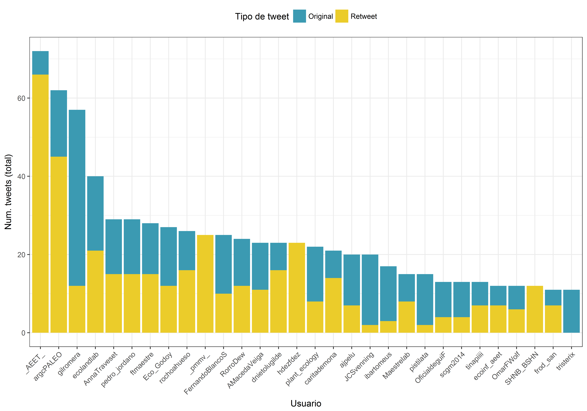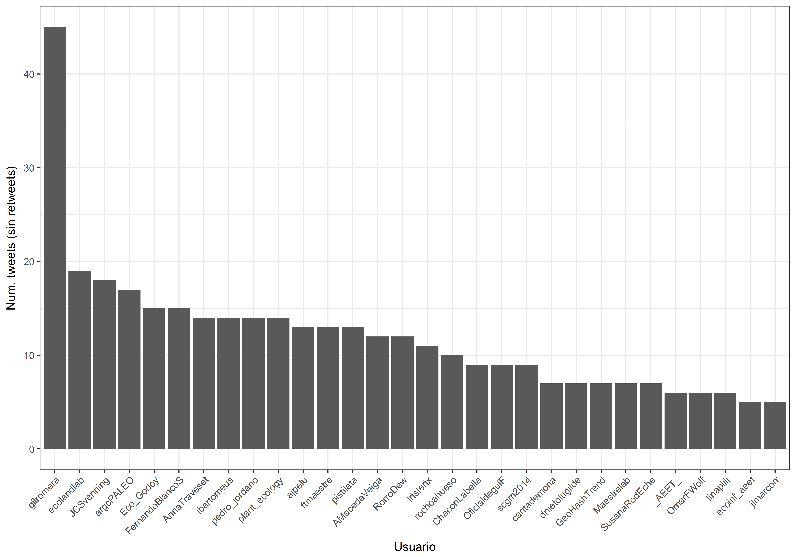

Si consideramos todos los tuits, las más prolíficas fueron la cuenta de la [AEET](http://twitter.com/_AEET_) y la de la paleontóloga [AR Gómez-Cano](http://twitter.com/argcPALEO). En cambio, si sólo consideramos los tuits originales, gana por goleada la paleoecóloga [Graciela Gil Romera](http://twitter.com/gilromera), con más de 40 tuits durante el congreso. Parece que lo *paleo* estuvo muy activo.


### Usuarios más populares

Podemos ver que usuarios resultaron más populares analizando la media de RT y FAVs que recibió cada usuario. (Nota: las figuras de abajo solo incluyen usuarios que han tuiteado mas de 3 veces, y no incluyen retuits).


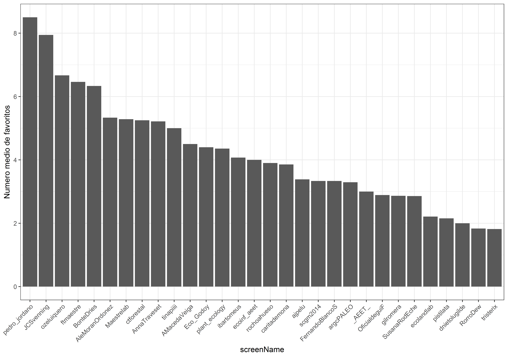

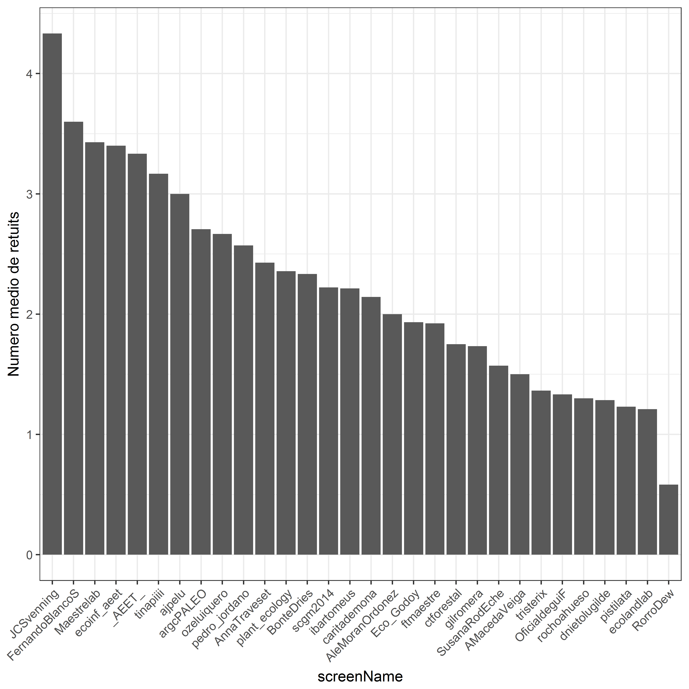
Parece que no hay grandes "superestrellas" que concentren la mayor parte de los RT y FAVs, sino que la progresión es bastante suave, aunque destacan perfiles de ecólogos muy reconocidos como [JC Svenning](http://twitter.com/JCSvenning), [Fernando Maestre](http://twitter.com/Maestrelab) o [Pedro Jordano](http://twitter.com/pedro_jordano), entre otros.

De hecho podríamos juntar RT + Favs como un indicador del impacto, y ver si los que más impacto tuvieron son también los que más tuitearon
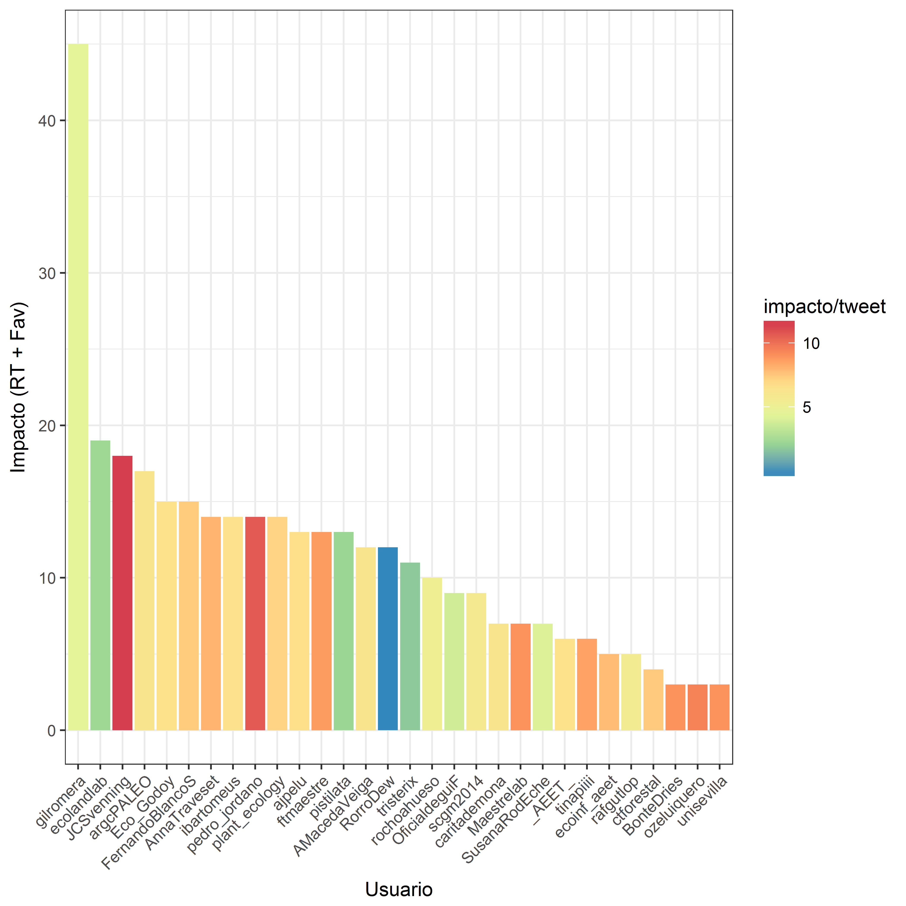

En líneas generales vemos que no es así, y que no hubo relación entre el número de tuits y el impacto medio de cada tuit.


### Word cloud

Estas fueron las 50 palabras más frecuentes en los tweets etiquetados con #AEETMED

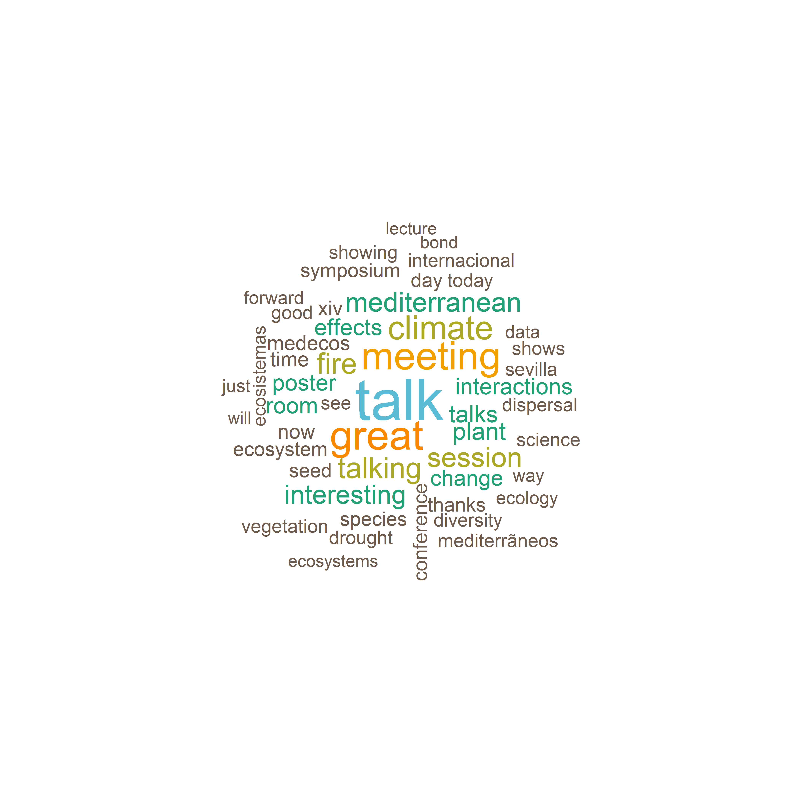
 Parece que efectivamente, en Sevilla hubo "grandes charlas". ;-)

### Menciones: twitter como plataforma de conversación

Una de las cosas buenas de twitter es cuando se montan pequeñas conversaciones entre varios usuarios sobre un tema concreto, y además no sería la primera vez que una de esas conversaciones deriva en un post de Forestalia. Usando las capacidades de las expresiones regulares (regexp) podemos identificar los usuarios que fueron mencionados más a menudo durante el congreso. 

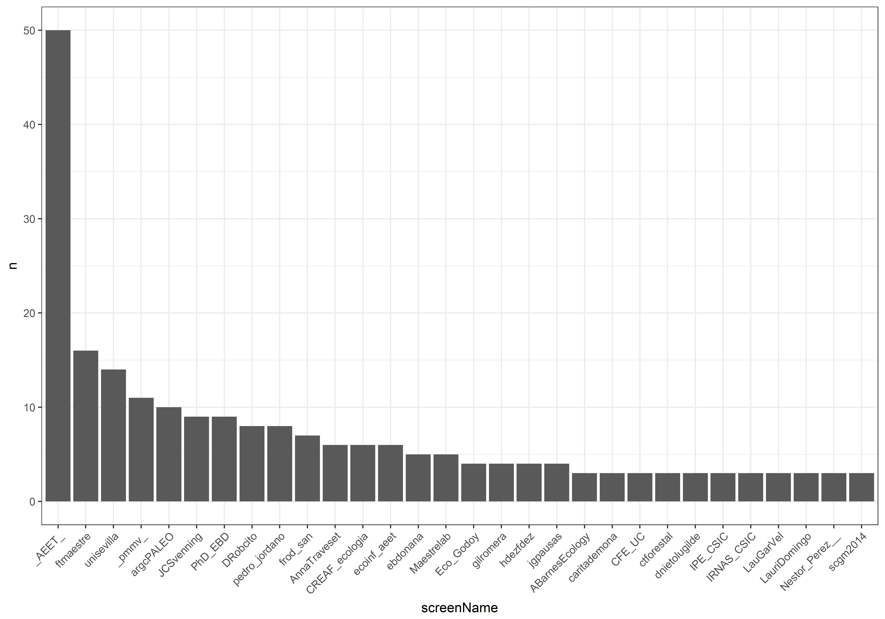

Pues aparte de los organizadores, y la sede, parece que los usuarios más mencionados fieron F.Maestre y el grupo de paleocología y vertebrados de UCM y CSIC. ¡Otra vez la *paleo*!


### Twitter como red social

Lo que hace únicas a las menciones de twitter respecto a otras redes sociales como facebook, es que se pueden rastrear las menciones de ida y vuelta. Por lo tanto, una vez extraídas las menciones podemos explorar las dinámicas de las conversaciones mediante un grafo, representando cada usuario como un véertice y las menciones como las aristas entre los vértices. Aquí quiero mencionar expresamente que esta parte del código está tomada del análisis que hizo [Keith H.Turner](http://twitter.com/kay_aych) para el [ISME2016](https://github.com/khturner/HashtagISME16).

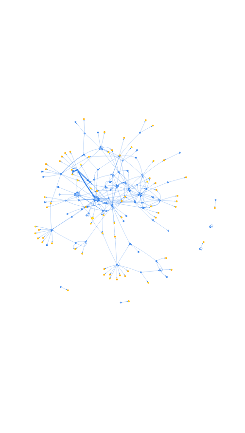

La verdad es que hay mucha información en este gráfico. Destaca que una buena parte de las conversaciones pasó por la cuenta oficial de la AEET, y también llaman la atención unas pocas cuentas que parecen tener una importante red de contactos en twitter (F.Maestre, JC. Svenning, P. Jordano, G. Gil-Romera) frente a las cuentas de los exteriores, que difundieron información sobre el congreso (por eso aparecen en azul) a numerosas personas que sólo recibieron menciones, pero no tuitearon (en amarillo).

Incluso podríamos aplicar análisis de cluster de grafos para ver en cuantos grupos se puede clasificar la tuitesfera del AEETMED.
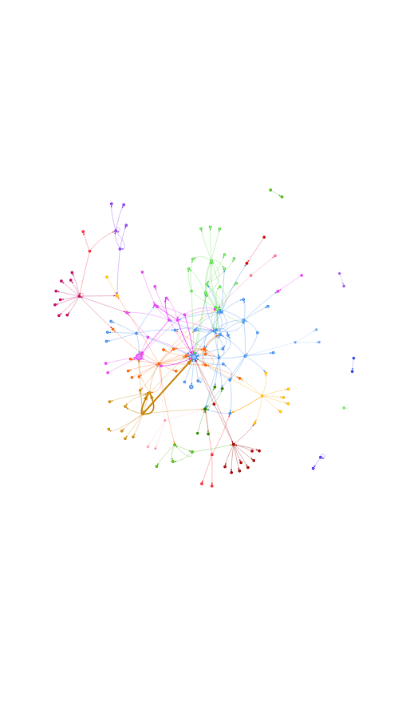

Usando los parámetros por defecto de la función random walk, el grafo de menciones se divide en 23 grupos distintos, algunos muy numerosos, otros formados sólo por dos usuarios. Es un gráfico superchulo, donde se puede ver como los colegas de la misma institución tienden a agruparse juntos, mientras que hay individuos que aparecen como puentes entre dos grupos más amplios. Os animo a que os busquéis y valoreis si el algortimos os ha clasificado bien u os habeis llevado una sorpresa. La verdad es que ver los datos asi hace valorar el paper de tuiter como difusor de la actividad en una conferencia!.


NOTA FINAL:
El codigo para generar el documento fue desarrollado originalmente por [Francois Michonneau](https://github.com/fmichonneau) ([fmic_](https://twitter.com/fmic_) en Twitter) para el congreso de Evoluci?n de 2015, y se puede encontrar [aqu?](https://github.com/fmichonneau/evol2015-tweets). El codigo ha sido posteriormente  [modificado](https://github.com/jlehtoma/iccb2015-tweets/blob/gh-pages/index.Rmd) para el congreso ICCB-ECCB 2015 por Joona Lehtomaki ([jlehtoma](https://twitter.com/jlehtoma) en Twitter), y por [Emily J. Rollinson](http://rollinsonecology.com) ([ejrollinson](https://twitter.com/ejrollinson) en Twitter), para los congresos de la Ecological Society of America de 2015 (Baltimore, #ESA100), y de 2016 (Fort Lauderdale, Florida, #ESA2016). También he incorporado algunos elementos del análisis de redes que hizo [Keith H.Turner](http://twitter.com/kay_aych) para el [ISME2016](https://github.com/khturner/HashtagISME16).

Los tweets que incluian el hashtag #AEETMED se recopilaron mediante el paquete [twitteR](https://cran.r-project.org/web/packages/twitteR/index.html) a partir de la API de Twitter. El documento se generó mediante RMarkdown, y el código fuente y los datos están
 [disponibles en mi GitHub](https://github.com/ameztegui/Hashtag_Analysis). El documento, así como el código asociado, tienen una [licencia CC0](https://creativecommons.org/choose/zero/?lang=es_ES).

